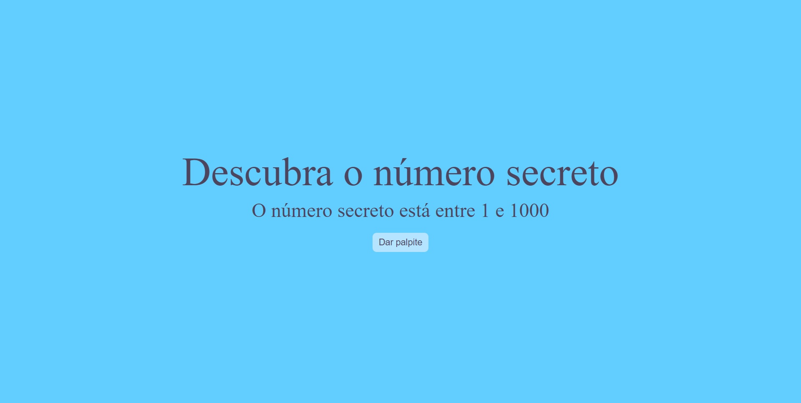

<h1 align="center"> Game descubra o número secreto </h1>

O objetivo do jogo é descobrir o número secreto, através de palpites por voz.

 

  

## ✔ Tecnologias

Esse projeto foi desenvolvido com as seguintes tecnologias:

- HTML e CSS
- JavaScript
- Git e Github

## 💻 Projeto

O objetivo do jogo é descobrir o número secreto, é só clicar no botão "Dar palpite" e dizer um número de 1 a 1000, caso erre vão haver dicas dizendo se o número é maior ou menor que seu palpite, divirtam-se! Se quiser finalizar o jogo antecipadamente, é só dizer "Game over" e o jogo será encerrado.
